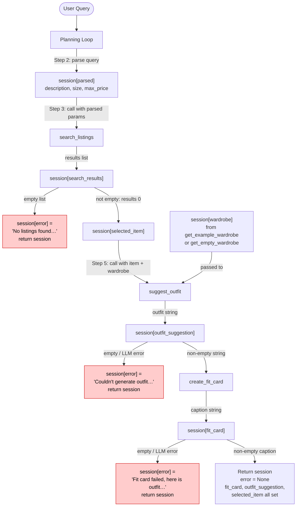

# FitFindr — planning.md

> Complete this document before writing any implementation code.
> Your spec and agent diagram are what you'll use to direct AI tools (Claude, Copilot, etc.) to generate your implementation — the more specific they are, the more useful the generated code will be.
> Your planning.md will be reviewed as part of your submission.
> Update it before starting any stretch features.

---

## What FitFindr Does

FitFindr is an AI-powered secondhand shopping assistant. Given a natural language query, it searches a mock listings dataset for matching items, then uses an LLM to suggest how to style the top result with the user's existing wardrobe, and finally generates a shareable social-media caption for the outfit. Each tool is triggered sequentially — `search_listings` first (triggered by the query), then `suggest_outfit` (triggered by a successful search result), then `create_fit_card` (triggered by a successful outfit suggestion). If any step produces no usable output — no search results, an LLM error, or an empty outfit string — the agent records a human-readable error message in the session and returns early without calling the remaining tools.

---

## Tools

List every tool your agent will use. For each tool, fill in all four fields.
You must have at least 3 tools. The three required tools are listed — add any additional tools below them.

### Tool 1: search_listings

**What it does:**
Searches the mock listings dataset for secondhand items that match the user's keywords, size, and price ceiling. Returns a ranked list of matching listing dicts, best match first.

**Input parameters:**
- `description` (str): Keywords describing the item the user wants (e.g., "vintage graphic tee"). Used for keyword-overlap scoring against each listing's `title`, `description`, and `style_tags`.
- `size` (str | None): Size string to filter by (e.g., "M", "S/M", "W30 L30"), or `None` to skip size filtering. Matching is case-insensitive; a listing matches if its `size` field contains the given string.
- `max_price` (float | None): Maximum price in USD (inclusive), or `None` to skip price filtering. Compared against the listing's `price` field (a float).

**What it returns:**
A `list[dict]` of listing dicts, sorted by keyword-overlap score descending. Each dict has these fields:
- `id` (str): unique listing identifier, e.g. `"lst_001"`
- `title` (str): short listing title, e.g. `"Vintage Levi's 501 Jeans — Medium Wash"`
- `description` (str): seller's free-text description
- `category` (str): one of `tops`, `bottoms`, `outerwear`, `shoes`, `accessories`
- `style_tags` (list[str]): descriptor tags, e.g. `["vintage", "streetwear"]`
- `size` (str): size string, e.g. `"M"`, `"S/M"`, `"W30 L30"`
- `condition` (str): one of `excellent`, `good`, `fair`
- `price` (float): asking price in USD
- `colors` (list[str]): color names, e.g. `["white", "black"]`
- `brand` (str | None): brand name or `None` if unbranded
- `platform` (str): one of `depop`, `thredUp`, `poshmark`

Returns an **empty list** (not an exception) if nothing matches.

**What happens if it fails or returns nothing:**
If the returned list is empty, the agent sets `session["error"]` to: `"No listings found matching '[original query]'. Try broadening your search — remove the size or price filter, or use more general keywords."` The agent then returns the session immediately without calling `suggest_outfit` or `create_fit_card`.

---

### Tool 2: suggest_outfit

**What it does:**
Sends the selected listing and the user's wardrobe to an LLM (via Groq) and asks it to suggest 1–2 complete outfit combinations. If the wardrobe is empty, the LLM provides general styling advice for the item instead of specific pairings.

**Input parameters:**
- `new_item` (dict): A listing dict (the top result from `search_listings`) containing at least `title`, `description`, `category`, `style_tags`, `colors`, and `price`.
- `wardrobe` (dict): A wardrobe dict with an `"items"` key whose value is a list of wardrobe item dicts. Each wardrobe item has `id` (str), `name` (str), `category` (str), `colors` (list[str]), `style_tags` (list[str]), and optional `notes` (str | None). The list may be empty.

**What it returns:**
A non-empty string containing the LLM's outfit suggestion. For a populated wardrobe, the suggestion will name specific wardrobe pieces by their `name` field. For an empty wardrobe, it will describe generic pieces that would complement the item's style and colors.

**What happens if it fails or returns nothing:**
If the LLM call raises an exception or returns an empty/whitespace-only string, the agent sets `session["error"]` to: `"We found a great item but couldn't generate outfit ideas right now. Try again in a moment."` The agent returns the session early without calling `create_fit_card`.

---

### Tool 3: create_fit_card

**What it does:**
Sends the outfit suggestion and item details to an LLM (via Groq at a higher temperature) to generate a 2–4 sentence caption written in the voice of an authentic OOTD social-media post.

**Input parameters:**
- `outfit` (str): The outfit suggestion string returned by `suggest_outfit`. Must be non-empty; the function guards against empty/whitespace input before calling the LLM.
- `new_item` (dict): The listing dict for the thrifted item, used to pull `title`, `price`, and `platform` into the caption naturally.

**What it returns:**
A 2–4 sentence string suitable for an Instagram or TikTok caption. The caption:
- Mentions the item name, price, and platform once each, woven in naturally (not as a bullet list)
- Describes the outfit vibe in specific, visual terms
- Sounds casual and personal, not like a product description
- Varies in phrasing each time (higher LLM temperature ensures this)

**What happens if it fails or returns nothing:**
If `outfit` is empty or whitespace-only, the function immediately returns the string: `"Couldn't generate a fit card — outfit details were missing."` If the LLM call fails, the agent sets `session["error"]` to: `"Your outfit idea is ready but we couldn't format the fit card. Here's the suggestion: [outfit_suggestion]"` so the user still gets value.

---

### Additional Tools (if any)

None — the three required tools cover the full interaction.

---

## Planning Loop

The planning loop runs sequentially, checks each step's output before proceeding, and exits early if any step produces no usable result. Here is the precise conditional logic:

1. **Initialize** the session with `_new_session(query, wardrobe)`.

2. **Parse the query** using regex + string splitting (no LLM call for parsing — it's faster and cheaper). Extract:
   - `description`: everything that isn't a size token or price token (e.g., "vintage graphic tee")
   - `size`: a token matching common size patterns (`XS`, `S`, `M`, `L`, `XL`, `XXL`, `XXS`, or `W\d+`, or `\d+`) — `None` if absent
   - `max_price`: a float following `"under $"` or `"under"` or `"$"` — `None` if absent
   Store as `session["parsed"] = {"description": ..., "size": ..., "max_price": ...}`.

3. **Call `search_listings(description, size, max_price)`**.
   - Store return value in `session["search_results"]`.
   - **If `search_results` is empty**: set `session["error"] = "No listings found matching '[query]'. Try broadening your search — remove the size or price filter, or use more general keywords."` and `return session` immediately.
   - **If not empty**: continue.

4. **Select the top result**: `session["selected_item"] = session["search_results"][0]`.

5. **Call `suggest_outfit(selected_item, wardrobe)`**.
   - Store return value in `session["outfit_suggestion"]`.
   - **If `outfit_suggestion` is empty or whitespace**: set `session["error"] = "We found a great item but couldn't generate outfit ideas right now. Try again in a moment."` and `return session` immediately.
   - **If not empty**: continue.

6. **Call `create_fit_card(outfit_suggestion, selected_item)`**.
   - Store return value in `session["fit_card"]`.
   - **If `fit_card` is empty or whitespace**: set `session["error"] = "Your outfit idea is ready but we couldn't format the fit card. Here's the suggestion: " + outfit_suggestion` and `return session`.
   - **If not empty**: continue.

7. **Return `session`** with `session["error"] = None` and all three output fields populated.

The loop never calls a downstream tool with empty or `None` input — each step acts as a gate.

---

## State Management

All state for a single interaction lives in the session dict returned by `_new_session()`. No global variables are used.

- `session["query"]` — the raw user query string; never mutated; used in error messages and as fallback context.
- `session["parsed"]` — set once in Step 2; read by Step 3 to supply arguments to `search_listings`.
- `session["search_results"]` — set in Step 3; checked for emptiness before Step 4; `results[0]` is written to `selected_item`.
- `session["selected_item"]` — set in Step 4; passed as the `new_item` argument to both `suggest_outfit` and `create_fit_card`.
- `session["wardrobe"]` — passed in at initialization; read by `suggest_outfit` only; never mutated.
- `session["outfit_suggestion"]` — set in Step 5; passed as the `outfit` argument to `create_fit_card`; also used verbatim in the error message if `create_fit_card` fails.
- `session["fit_card"]` — set in Step 6; the primary output shown to the user.
- `session["error"]` — `None` on a successful run; set to a human-readable string at the first failure point; the caller (`handle_query` in `app.py`) checks this before reading any other output field.

Tools do not read from the session dict directly — they receive plain Python values as arguments. The planning loop is the only component that reads and writes the session.

---

## Error Handling

| Tool | Failure mode | Agent response |
|------|-------------|----------------|
| search_listings | No results match the query | Set `session["error"]` = `"No listings found matching '[original query]'. Try broadening your search — remove the size or price filter, or use more general keywords."` Return session immediately. |
| suggest_outfit | Wardrobe is empty | Do NOT treat as an error — instead pass the empty wardrobe to the LLM and prompt it for general styling advice for the item. Only set an error if the LLM call itself fails. |
| suggest_outfit | LLM call fails or returns empty string | Set `session["error"]` = `"We found a great item but couldn't generate outfit ideas right now. Try again in a moment."` Return session early. |
| create_fit_card | `outfit` argument is empty or whitespace-only | Return the string `"Couldn't generate a fit card — outfit details were missing."` from within the function (no exception). |
| create_fit_card | LLM call fails | Set `session["error"]` = `"Your outfit idea is ready but we couldn't format the fit card. Here's the suggestion: [outfit_suggestion]"` Return session. |

---

## Architecture



**Key design decisions visible in the diagram:**
- The wardrobe enters directly into `suggest_outfit` — it is never modified or stored as a search result.
- Every tool output is written to the session before being checked; the check gate comes after the write.
- Error paths all terminate with `return session` — no downstream tools are called after an error.
- `get_example_wardrobe()` is used for normal testing; `get_empty_wardrobe()` is used to test the empty-wardrobe graceful-handling branch in `suggest_outfit`.

---

## AI Tool Plan

### Milestone 3 — Individual tool implementations

**Tool 1 — `search_listings`:**
I'll give Claude the Tool 1 block from this planning.md (inputs, return value description, failure mode) and the first 3 listing dicts from `listings.json` as examples of the data shape. I'll ask it to implement the function using `load_listings()` from `data_loader.py`, filtering by `max_price` and `size` first, then scoring by keyword overlap against `title`, `description`, and `style_tags` combined.
Expected output: a working `search_listings()` function.
Verification: I'll test with three queries — (1) `"vintage graphic tee"` with no filters (should return multiple results), (2) `"graphic tee"` with `size="M"` and `max_price=25.0` (should filter down), (3) `"designer ballgown"` with `max_price=5.0` (should return empty list). I'll check that the returned dicts have all required fields.

**Tool 2 — `suggest_outfit`:**
I'll give Claude the Tool 2 block from this planning.md plus the `wardrobe_schema.json` example wardrobe as context. I'll ask it to implement `suggest_outfit()` using the Groq client from `_get_groq_client()`, with two prompt branches: one for a populated wardrobe (name specific pieces) and one for an empty wardrobe (general styling advice).
Expected output: a function that returns a non-empty string in both cases.
Verification: I'll call it once with the example wardrobe and once with `get_empty_wardrobe()`, and confirm both return readable, non-empty strings. I'll also check it doesn't raise an exception when `wardrobe["items"]` is `[]`.

**Tool 3 — `create_fit_card`:**
I'll give Claude the Tool 3 block from this planning.md, emphasizing the caption style guidelines (casual, mentions item/price/platform once, specific vibe). I'll ask it to use a higher temperature (0.9) and guard against an empty `outfit` string before making the API call.
Expected output: a function that returns a 2–4 sentence caption.
Verification: I'll call it with a sample outfit string and a listing dict and check the output mentions the item name and price. I'll also call it with an empty `outfit` string and confirm it returns the error string rather than calling the LLM or raising an exception.

### Milestone 4 — Planning loop and state management

I'll give Claude: (1) the Planning Loop section of this document (the 7-step conditional logic), (2) the State Management section, (3) the Architecture Mermaid diagram, and (4) the existing `_new_session()` function signature from `agent.py`. I'll ask it to implement `run_agent()` to match the exact step sequence, using only the session dict for state and passing plain values (not the session) into each tool.
Expected output: a `run_agent()` function body.
Verification: I'll run the `__main__` block in `agent.py` with two cases — the happy path `"vintage graphic tee under $30"` and the no-results path `"designer ballgown size XXS under $5"` — and confirm the happy path returns a non-None `fit_card` and the no-results path returns a non-None `error` with a helpful message.

---

## A Complete Interaction (Step by Step)

**Example user query:** "I'm looking for a vintage graphic tee under $30. I mostly wear baggy jeans and chunky sneakers. What's out there and how would I style it?"

**Step 1 — Query parsing (inside the planning loop, no tool call):**
The loop parses the query using regex. It extracts:
- `description = "vintage graphic tee"` (the style/item keywords; the "I mostly wear…" sentence is ignored because it contains no size or price tokens)
- `size = None` (no size token like "M" or "S/M" found)
- `max_price = 30.0` (extracted from "under $30")

These are stored in `session["parsed"]`.

**Step 2 — `search_listings("vintage graphic tee", size=None, max_price=30.0)`:**
The tool loads all listings from `listings.json`, drops any with `price > 30.0`, then scores the remainder by counting how many of the words `["vintage", "graphic", "tee"]` appear in each listing's `title`, `description`, and `style_tags` (case-insensitive). Listings with a score of 0 are dropped. The remaining listings are sorted by score descending.

Example return value (first item):
```json
{
  "id": "lst_002",
  "title": "Y2K Baby Tee — Butterfly Print",
  "description": "Super cute early 2000s baby tee with butterfly graphic. Fitted crop length.",
  "category": "tops",
  "style_tags": ["y2k", "vintage", "graphic tee", "cottagecore"],
  "size": "S/M",
  "condition": "excellent",
  "price": 18.00,
  "colors": ["white", "pink", "purple"],
  "brand": null,
  "platform": "depop"
}
```

`session["search_results"]` is set to this list. The list is non-empty, so the loop continues. `session["selected_item"]` is set to the first result (the dict above).

**Step 3 — `suggest_outfit(new_item, wardrobe)`:**
The tool receives the Y2K Baby Tee dict and the example wardrobe (10 items). Since `wardrobe["items"]` is not empty, it builds a prompt listing the wardrobe pieces by name and asks the LLM to suggest 1–2 outfits using the new item and specific named wardrobe pieces.

Example LLM response stored in `session["outfit_suggestion"]`:
> "Outfit 1: Pair the Y2K Baby Tee with your Baggy straight-leg jeans (dark wash) and Chunky white sneakers for a clean vintage-streetwear look. Add the Black crossbody bag to keep it casual.
> Outfit 2: Tuck the tee into your Wide-leg khaki trousers and wear it with Black combat boots for a grungier Y2K take. Layer the Vintage black denim jacket over top for extra edge."

**Step 4 — `create_fit_card(outfit_suggestion, selected_item)`:**
The tool receives the outfit string above and the Y2K Baby Tee listing dict. It builds a prompt asking the LLM for a 2–4 sentence Instagram caption that mentions the item name, the $18 price, and depop, sounds casual, and captures the outfit vibe. A temperature of 0.9 is used.

Example return stored in `session["fit_card"]`:
> "thrifted this Y2K Baby Tee off depop for $18 and honestly it's the piece my whole wardrobe was waiting for 🦋 dark-wash baggies + chunky white sneakers and we're giving vintage street with a soft side. or go full grunge era — khakis, combat boots, and the old denim jacket over top. both fits, zero regrets."

**Final output to user:**
In the Gradio UI, `handle_query()` reads the session and populates three panels:
- **Top listing found:** Title, price, platform, condition, size, colors, and a short excerpt from the seller's description — all formatted as plain text.
- **Outfit idea:** The full `session["outfit_suggestion"]` string.
- **Your fit card:** The `session["fit_card"]` caption string.

If the query had been `"designer ballgown size XXS under $5"`, `search_listings` would return `[]`, the loop would set `session["error"] = "No listings found matching 'designer ballgown size XXS under $5'. Try broadening your search — remove the size or price filter, or use more general keywords."`, and `handle_query()` would display that error in the first panel with empty strings in the other two.
